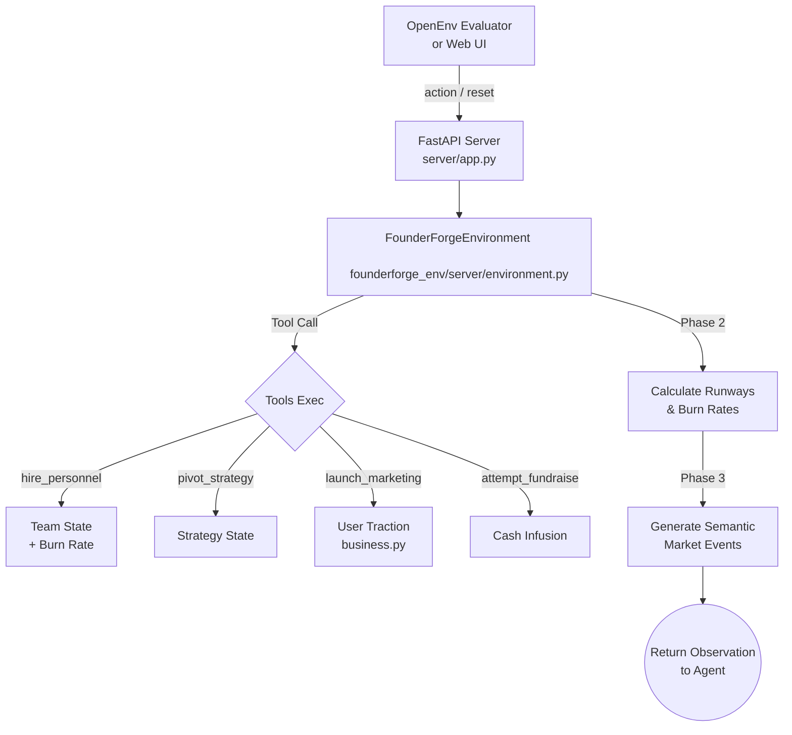

# 🏢 FounderForge — Startup CEO Simulator

> **An OpenEnv benchmark that evaluates LLM agents on real-world startup management: financial planning, team building, market adaptation, and fundraising — all through native tool calling.**

---

## 🌍 Why FounderForge?

**Every tech startup faces the same brutal challenge:** burn rate vs. growth. CEOs must simultaneously manage hiring, marketing spend, fundraising timing, and strategic pivots — often reacting to unpredictable market events. This requires:

- 📊 **Quantitative reasoning** — budget allocation, burn rate math, ROI estimation
- 📖 **Reading comprehension** — interpreting unstructured market reports to identify threats
- 🧠 **Strategic planning** — multi-step reasoning about when to hire, pivot, or fundraise
- ⚡ **Crisis management** — reacting to black-swan events (bank runs, recessions) under time pressure

Unlike toy environments, FounderForge models a task that **millions of real humans do daily**, making it immediately useful for evaluating agent decision intelligence.

---

## 🎯 Tasks

| Task | Difficulty | Cash | Months | Target Users | Market Events |
|------|-----------|------|--------|-------------|---------------|
| `bootstrap_survival` | 🟢 Easy | $250k | 12 | 5,000 | None |
| `growth_stage` | 🟡 Medium | $1M | 24 | 50,000 | Moderate (competitor threats, ad cost spikes) |
| `unicorn_ipo` | 🔴 Hard | $5M | 36 | 1,000,000 | Extreme (bank runs, recessions, talent wars) |

Each task has a **dedicated programmatic grader** with weighted multi-criteria scoring (user growth, funding progress, cash efficiency, team scaling).

---

## 🛠 Tools (Agent Actions)

The environment exposes 5 tools via the OpenAI function-calling schema:

| Tool | Effect | Cost |
|------|--------|------|
| `hire_personnel(role)` | Add engineer (+$12k/mo, +0.5 quality) or sales (+$8k/mo) | Monthly salary |
| `layoff_staff(role)` | Remove a team member, cut burn rate | -0.2 product quality |
| `pivot_strategy(focus)` | Switch to `product_led`, `sales_led`, or `survival_mode` | Strategy trade-offs |
| `launch_marketing_campaign(spend)` | Acquire users: `sqrt(spend) × quality × 10` | One-time cash |
| `attempt_fundraise(round)` | Pitch VCs for Pre-Seed through IPO | Requires user threshold |

---

## 💰 Reward Design

FounderForge uses **dense, continuous reward shaping** — not sparse binary signals:

- **Base reward**: `users / target_users` (task progress)
- **Bonuses**: +0.08 to +0.12 for correctly responding to market events
- **Penalties**: -0.04 to -0.30 for ignoring crises or going bankrupt
- **Final score**: Multi-criteria grader weighing users, funding, cash, team, and quality
- **Bounds**: All scores strictly in `[0.01, 0.99]`

---

## 📋 Action / Observation Schema

```python
class FounderForgeAction(Action):
    action_type: str          # "ToolCallAction", "skip", or "finish"
    tool_name: Optional[str]  # e.g., "hire_personnel"
    arguments: Optional[dict] # e.g., {"role": "engineer"}

class FounderForgeObservation(Observation):
    cash: float               # Current balance
    users: float              # Total user base
    product_quality: float    # Engineering quality multiplier
    team: dict                # {"engineers": int, "sales": int}
    current_round: str        # Last funding round closed
    strategy: str             # Current strategic focus
    last_action_result: str   # Market report + action summary
    tools_list: list          # Available tools in OpenAI schema
    tool_result: Optional[str] # Result of last tool execution
```

---

## 🚀 Quick Start

### Run Tests
```bash
pip install -e ".[dev]"
pytest tests/ -v
```

### Run Inference
```bash
export HF_TOKEN=your_token_here
python inference.py
```

### Docker Build & Run
```bash
docker build -t founderforge .
docker run -p 7860:7860 founderforge
```

---

## 🏗️ Execution Architecture



---

## 📁 Project Structure (OpenEnv Validation Compliant)
```
├── server/
│   ├── __init__.py
│   └── app.py            # FastAPI HTTP wrapper + web UI
├── founderforge_env/
│   ├── __init__.py
│   ├── models.py             # Typed Action & Observation schemas
│   ├── business.py           # Financial simulation engine
│   ├── evaluation.py         # Programmatic graders (3 tasks)
│   ├── static/
│   │   └── index.html        # Interactive web dashboard
│   └── server/
│       └── environment.py    # Core environment (reset/step/state)
├── tests/
│   ├── test_business_logic.py
│   ├── test_environment_actions.py
│   └── test_evaluation.py
├── openenv.yaml              # Benchmark manifest with 3 tasks + graders
├── pyproject.toml            # Package configuration
├── uv.lock                   # Lockfile for reproducible builds
├── Dockerfile                # OpenEnv-compatible multi-stage build
└── inference.py              # Baseline agent with tool-calling
```

---

## 🏆 What Makes This Environment Special

1. **Semantic Reasoning Required**: Market events are unstructured text that the agent must interpret — not just pattern-match numbers.
2. **Tool-Calling Native**: Uses the exact OpenAI function-calling schema, matching top-tier benchmarks like `calendar_env`.
3. **Dense Reward Signal**: Every step provides meaningful feedback, not just a binary win/lose at the end.
4. **Real Difficulty Progression**: Easy mode is pure math. Hard mode requires reading comprehension, crisis management, and long-horizon planning.
5. **Deterministic Grading**: Seeded RNG ensures reproducible episodes for fair evaluation.
6. **Interactive Web Dashboard**: Human reviewers can play the simulator directly in-browser.
